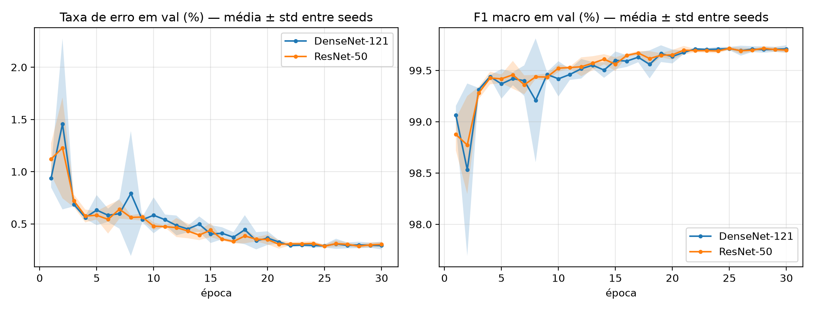
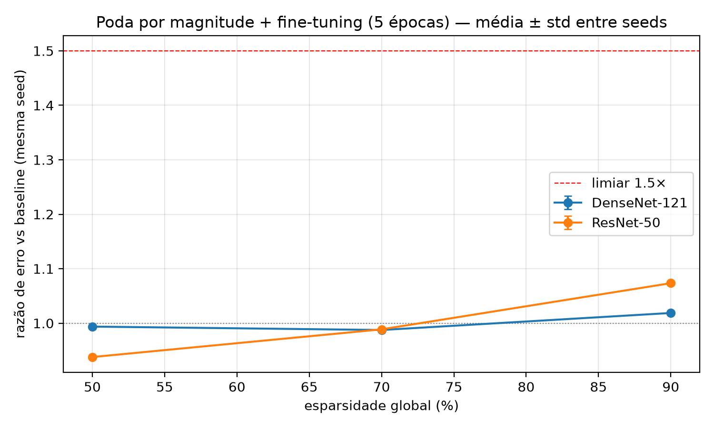
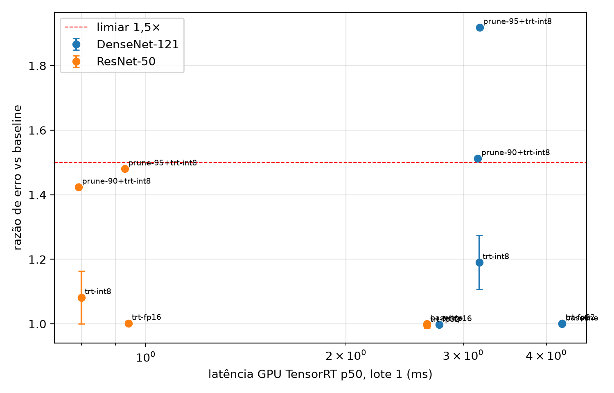
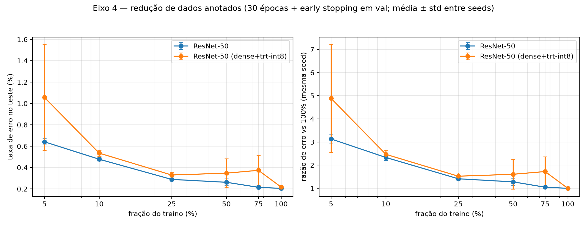

# Resultados — sumário executivo

Todos os números vêm de `results/<eixo>/*.csv`, gerados por scripts a partir de `runs/` (`make results`). Teste = 83.613 imagens de
6.044 sujeitos disjuntos do treino, avaliado uma única vez por run, no checkpoint escolhido pela validação interna. Média ± desvio de
3 seeds, salvo indicação. **Razão de erro** = taxa de erro da célula ÷ taxa de erro do baseline da mesma seed.

## Eixo 1 — ResNet-50 × DenseNet-121 ([detalhes](results/eixo1/README.md))

| | ResNet-50 | DenseNet-121 |
|---|---|---|
| acurácia | 99,793 ± 0,009% | 99,803 ± 0,005% |
| taxa de erro (erros por seed) | 0,207 ± 0,009% (177, 165, 178) | 0,197 ± 0,005% (160, 167, 167) |
| parâmetros / MACs | 23,5 M / 4,11 G | 6,97 M / 2,86 G |
| tempo de treino por época | 164 s | 203 s |

**As arquiteturas empatam em erro** (Δ = 0,010 p.p., abaixo de 2× o desvio entre seeds). O piso de ~0,2% é em boa parte ruído de rótulo:
117 imagens são erradas pelas duas redes, em 109 delas com a mesma predição ([análise](results/analise/README.md)). A DenseNet tem 3,4× menos
parâmetros e 30% menos MACs, mas é mais lenta em todos os runtimes medidos. 

## Eixo 2 — compressão ([detalhes](results/eixo2/README.md))

| razão de erro | ResNet-50 | DenseNet-121 |
|---|---|---|
| poda 50% / 70% | 0,97 / 0,98 | 0,97 / 0,98 |
| poda 90% | 1,10 ± 0,03 | 1,03 ± 0,04 |
| poda 95% | 1,28 ± 0,07 | 1,19 ± 0,05 |
| poda 98% (joelho, > 1,5×) | 1,90 ± 0,17 | 1,65 ± 0,05 |
| int8 CPU (fbgemm) | 1,04 ± 0,07 | 1,24 ± 0,07 |
| int8 GPU (TensorRT) | 1,01 ± 0,03 | 1,07 ± 0,03 |
| poda 90% + int8 (CPU / TensorRT, seed 0) | 1,14 / 1,10 | 1,37 / 1,16 |

90% dos pesos são dispensáveis nas duas redes; o joelho está em 98%. A poda não-estruturada reduz o artefato comprimido (21% do original
a 90%) mas **não a latência**. A int8 é gratuita para a ResNet-50; à DenseNet-121 custa 24% de erro em CPU. **Podar antes ou depois do treino**
(seed 0): o que decide é o orçamento de retreino, não a ordem. A 98%, podar o modelo treinado e retreinar 30 épocas dá 1,10× (ResNet-50) e
1,33× (DenseNet-121), contra 1,36× / 1,64× podando os pesos ImageNet antes do treino e 1,90× / 1,65× com o fine-tuning de 5 épocas — o
joelho de 98% é do protocolo curto, não das redes. 

## Eixo 3 — benchmark ([detalhes](results/eixo3/README.md), [decisão](results/eixo3/decision.md))

| latência p50, lote 1 | ResNet-50 | DenseNet-121 |
|---|---|---|
| CPU FP32 eager, 16 threads | 10,7 ms | 16,6 ms |
| CPU int8 fbgemm, 16 threads | **1,38 ms** | 2,86 ms |
| GPU TensorRT FP32 / FP16 / INT8 _(preliminar)_ | 2,65 / 0,94 / **0,80 ms** | 4,23 / 2,76 / 3,17 ms |
| modelos podados (CPU, 16 threads) | 10,9–11,4 ms (= baseline) | 15,8–16,5 ms (= baseline) |

**Configuração vencedora: ResNet-50 int8 TensorRT** — razão de erro 1,01, 0,80 ms por imagem, artefato de 23,9 MiB (critério fixado antes
dos resultados: menor latência GPU entre as células com razão ≤ 1,5). A int8 da DenseNet é mais lenta que a FP16 no TensorRT. A latência de
GPU é preliminar (medida com a sessão gráfica aberta). 

## Eixo 4 — redução de dados anotados (ResNet-50; [dados](results/eixo4/eixo4_summary.csv))

| fração do treino | imagens | razão de erro, FP32 | razão de erro, int8 TensorRT | erros por seed (FP32) |
|---|---|---|---|---|
| 100% | 175.591 | 1,00 | 1,00 | 177, 172, 165 |
| 75% | 131.693 | 1,05 ± 0,05 | 1,07 ± 0,05 | 183, 189, 167 |
| 50% | 87.798 | 1,28 ± 0,16 | 1,31 ± 0,18 | 201, 250, 206 |
| 25% | 43.898 | 1,41 ± 0,09 | 1,49 ± 0,09 | 232, 251, 242 |
| 10% | 17.561 | 2,33 ± 0,13 | 2,45 ± 0,13 | 403, 385, 410 |
| 5% | 8.782 | 3,13 ± 0,21 | 3,30 ± 0,21 | 511, 559, 538 |

Com um quarto dos dados o erro sobe 41%; o joelho está entre 25% e 10%. Mesmo com 5% (8,8 mil imagens) a acurácia é 99,36%. A curva segue
uma lei de potência, erro ∝ N^-0,38 (R² 0,98), e a versão int8 da configuração vencedora a acompanha ponto a ponto. Regime: fine-tuning a
partir de ImageNet, 30 épocas fixas. 

## Validade ([auditoria](results/audit/README.md))

Pipeline sem vazamento (sujeitos disjuntos, manifesto = fonte em 100% das linhas, rótulos embaralhados → acaso). O HaGRID tem sujeitos com
mais de um `user_id`: 0,10% do teste é quase idêntico a imagens de treino; pior caso conservador de 99,72% de acurácia. Num holdout externo
de 278.702 imagens de 19.042 sujeitos nunca usados, o erro é 0,235% (ResNet-50) e 0,216% (DenseNet-121).

## Lições de método registradas

1. Parada antecipada com paciência curta **trunca a agenda cosseno**: 13 de 18 runs do eixo 4 pararam com o lr ainda alto; corrigido para 30 épocas fixas.
2. A calibração da int8 é um hiperparâmetro: com entropia, o mesmo modelo foi de 194 a 2.596 erros conforme a amostra de calibração; percentil 99,99, escolhido em validação, é estável.
3. O `user_id` de um dataset crowdsourced não é identidade perfeita; o efeito foi medido em vez de presumido.
