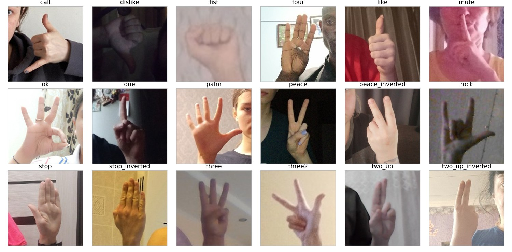
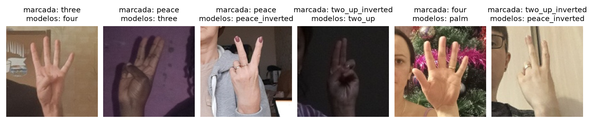
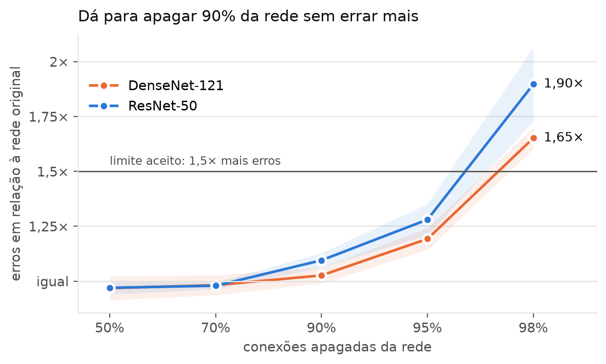
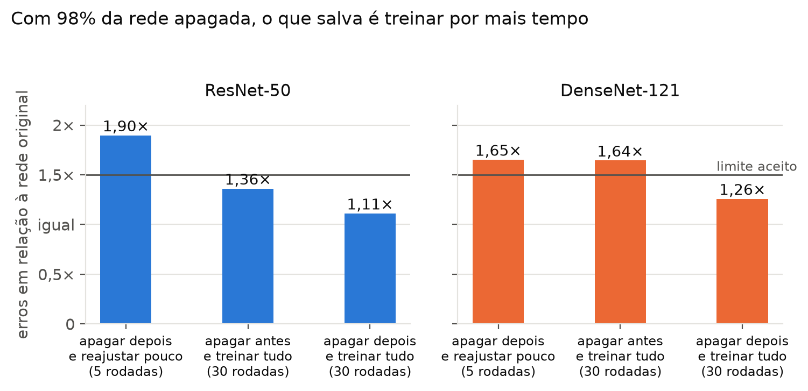
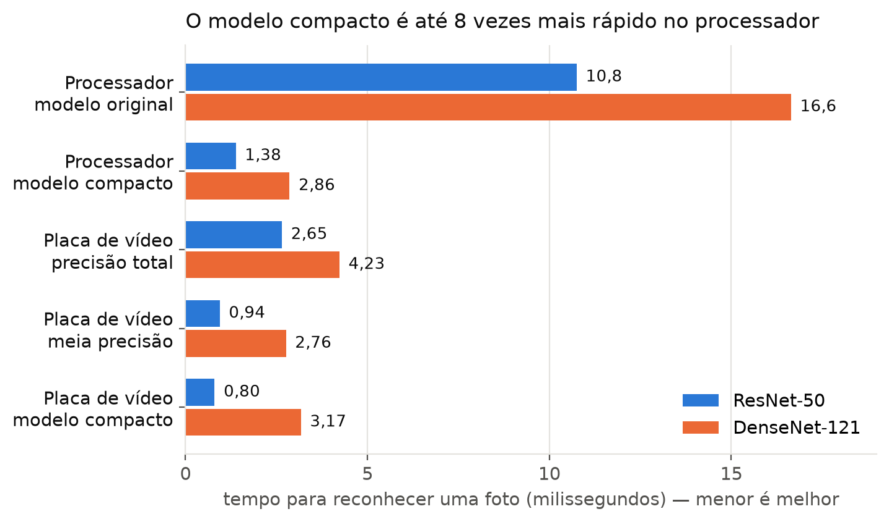
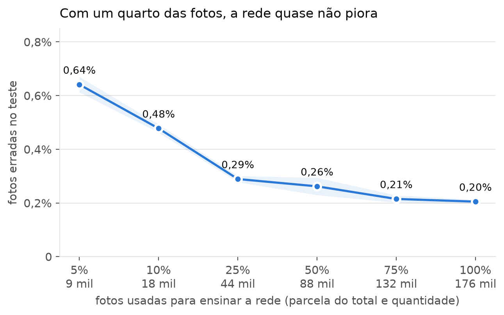

# Reconhecimento de gestos de mão com redes neurais

**Relatório de andamento — 21 de setembro de 2026**

## Resumo

- Ensinamos dois modelos de inteligência artificial a reconhecer **18 gestos de mão** em fotos. Os dois acertam **99,8%** das fotos de pessoas que nunca viram.
- Esse número foi conferido de cinco formas diferentes e **se sustenta**. Boa parte dos poucos erros que sobram são fotos que o próprio conjunto de dados rotulou errado.
- É possível **apagar 90% de cada modelo** sem ele errar mais, e guardar o que sobra de forma mais compacta. O modelo compacto responde até **8 vezes mais rápido**.
- A melhor combinação encontrada reconhece um gesto em **0,8 milésimo de segundo**, errando praticamente o mesmo que o modelo original.
- Com **um quarto das fotos de treino** o modelo ainda erra só 0,29%. Abaixo disso a qualidade cai rápido.
- As quatro etapas previstas estão concluídas. Falta uma medição final de velocidade e a repetição de um experimento extra.

**Como ler os números.** Como os modelos quase não erram, comparar "99,79% com 99,80%" não diz nada. Por isso contamos **erros**: "1,5×" quer dizer "uma vez e meia os erros do modelo original". Cada experimento foi repetido 3 vezes; "±" é a variação entre as repetições.

## 1. O problema e os dados

O modelo recebe a foto recortada em volta da mão e responde qual dos 18 gestos ela mostra. As fotos vêm do HaGRID, um conjunto público com pessoas do mundo todo fotografadas em casa.

| | quantidade |
|---|---|
| Fotos usadas | 278.715, de 20.117 pessoas |
| Para ensinar o modelo | 175.591 fotos |
| Para acompanhar o aprendizado | 19.511 fotos |
| Para a prova final | 83.613 fotos, de 6.044 pessoas |

Regra mais importante do projeto: **uma pessoa nunca aparece em dois grupos**. Se aparecesse, o modelo poderia reconhecer a pessoa ou o quarto dela, e não o gesto. A prova final só é usada uma vez por modelo, no fim.

## 2. Etapa 1 — dois modelos comparados

Testamos duas "arquiteturas" conhecidas, que organizam suas camadas de jeitos opostos. Ambas partem de um modelo já treinado em fotos gerais e são ajustadas para gestos.

| | ResNet-50 | DenseNet-121 |
|---|---|---|
| Acerto na prova final | 99,79% | 99,80% |
| Fotos erradas (de 83.613), nas 3 repetições | 177, 165, 178 | 160, 167, 167 |
| Tamanho do modelo | 90 MB | 27 MB |
| Tempo de treino | 1 h 26 min | 1 h 47 min |

**Empate em qualidade.** A diferença entre os dois é menor que a variação entre repetições do mesmo modelo. A DenseNet é três vezes menor, mas mais lenta.

## 3. O resultado é confiável?

Um acerto tão alto levanta suspeita, então fizemos uma auditoria.

| Verificação | Resultado |
|---|---|
| Alguma pessoa em dois grupos? | Nenhuma |
| A lista de fotos confere com os arquivos originais? | 278.715 de 278.715 |
| Fotos repetidas entre treino e prova? | Nenhuma idêntica |
| Se embaralharmos as respostas certas no treino, o modelo ainda acerta? | Não: 4,9%, o mesmo que chutar |
| E em 278.702 fotos de 19.042 pessoas que ficaram de fora do projeto? | Acerta 99,77% |

**Um problema real foi encontrado no conjunto de dados:** algumas pessoas têm mais de um cadastro, então 87 fotos da prova (0,1%) são quase iguais a fotos do treino. Retirando da prova todas as pessoas suspeitas, no pior cenário o acerto cai de 99,79% para 99,72%. Não muda a conclusão.

**Por que sobram erros?** Das cerca de 170 fotos erradas, 117 são erradas pelos **dois** modelos, e em 109 delas os dois dão a mesma resposta. Olhando essas fotos, muitas estão rotuladas errado na origem. Abaixo, seis exemplos: o que o conjunto de dados diz ("marcada") e o que os dois modelos respondem.

## 4. Etapa 2 — deixar o modelo menor

### Apagar conexões

Um modelo tem milhões de conexões, e muitas quase não influenciam a resposta. Apagamos as mais fracas e fizemos um ajuste rápido depois.

| Conexões apagadas | ResNet-50 | DenseNet-121 | Tamanho do arquivo |
|---|---|---|---|
| 50% e 70% | igual | igual | 61% e 42% do original |
| 90% | 1,10× | 1,03× | 21% |
| 95% | 1,28× | 1,19× | cerca de 15% |
| 98% | 1,90× | 1,65× | cerca de 11% |

Nove em cada dez conexões são dispensáveis. **Limitação importante:** apagar conexões deixa o arquivo menor, mas **não deixa o modelo mais rápido**, porque o computador faz as mesmas contas, só que com zeros.

### Guardar os números com menos precisão

A segunda técnica guarda cada número do modelo em 8 bits em vez de 32. O arquivo fica com um quarto do tamanho e as contas ficam mais rápidas. Chamamos esse de **modelo compacto**.

| Modelo compacto | ResNet-50 | DenseNet-121 |
|---|---|---|
| Erros, rodando no processador | 1,04× | 1,24× |
| Erros, rodando na placa de vídeo | 1,01× | 1,07× |
| Tamanho | 23 MB | 8 MB |

Para a ResNet a compactação sai de graça. A DenseNet perde qualidade no processador.

### Apagar antes ou depois de treinar?

A pedido do orientador, testamos apagar as conexões **antes** do treino. O resultado surpreendeu: a ordem importa pouco. **O que importa é quanto tempo o modelo treina depois de ter conexões apagadas.**

Com 95% apagado, as três formas dão resultados parecidos. Com 98%, treinar por mais tempo depois de apagar resolve o problema nos dois modelos. Este experimento tem por enquanto uma ou duas repetições; as demais estão rodando.

## 5. Etapa 3 — qual versão é a melhor?

| Tempo por foto (milissegundos) | ResNet-50 | DenseNet-121 |
|---|---|---|
| Processador, modelo original | 10,8 | 16,6 |
| Processador, modelo compacto | 1,38 | 2,86 |
| Placa de vídeo, precisão total | 2,65 | 4,23 |
| Placa de vídeo, modelo compacto | **0,80** | 3,17 |
| Modelo com 90% apagado (processador) | 10,9 | 16,5 |

A regra de escolha foi definida **antes** de ver os resultados: entre as versões que erram no máximo 1,5× o original, vence a mais rápida na placa de vídeo.

**Vencedora: ResNet-50 compacta** — 0,80 ms por foto, erros 1,01×, arquivo de 24 MB.

Três aprendizados: a DenseNet faz menos contas no papel, mas é mais lenta em todas as medições; a versão compacta da DenseNet ficou mais lenta que a de meia precisão na placa de vídeo; apagar conexões não mudou a velocidade.

## 6. Etapa 4 — e se houvesse menos fotos?

Rotular fotos é caro. Treinamos a versão vencedora com cada vez menos fotos, sempre com a mesma prova final.

| Fotos de treino | Quantidade | Erros (modelo original) | Erros (modelo compacto) |
|---|---|---|---|
| 100% | 175.591 | referência | referência |
| 75% | 131.693 | 1,05× | 1,07× |
| 50% | 87.798 | 1,28× | 1,31× |
| 25% | 43.898 | 1,41× | 1,49× |
| 10% | 17.561 | 2,33× | 2,45× |
| 5% | 8.782 | 3,13× | 3,30× |

Com um quarto das fotos, o erro sobe 41%. O ponto de virada fica entre 25% e 10%. Mesmo com 5% das fotos o modelo acerta 99,36%. O modelo compacto acompanha o original em todos os pontos.

## 7. Problemas encontrados e corrigidos

- **Treinos interrompidos cedo demais.** Uma regra de "parar quando deixar de melhorar" estava cortando 13 dos 18 treinos da etapa 4 antes da fase final, que é onde o modelo mais ganha. Um ponto chegou a 277 erros em vez de 165. A regra foi retirada e os treinos foram continuados de onde pararam.
- **Compactação instável na placa de vídeo.** O ajuste da compactação usa uma amostra de 1.024 fotos. Com o método inicial, o mesmo modelo ia de 194 a 2.596 erros dependendo da amostra sorteada. Testamos quatro métodos e adotamos o mais estável, que varia de 62 a 64 erros onde o original faz 60. As 28 medições afetadas foram refeitas.
- **Memória estourada.** Esse mesmo ajuste chegou a usar 53 GB de memória e derrubou o computador duas vezes. Foi reescrito para trabalhar em partes pequenas.

## 8. Em andamento e pendente

| Item | Situação |
|---|---|
| Repetições do experimento "antes ou depois" com 95% e 98% apagados | Rodando: 3 de 16 treinos concluídos, cerca de 21 horas restantes |
| Medição final de velocidade na placa de vídeo | Pendente: precisa ser feita com a tela gráfica fechada. Os tempos de placa de vídeo deste relatório são preliminares |
| Confirmar com o orientador dois ajustes feitos no caminho | Pendente: a retirada da parada antecipada e o critério de desempate quando duas versões têm praticamente a mesma velocidade |
| Artigo e pôster | A partir de 1º de novembro |

## 9. O que já está entregue

- **Código, resultados e registros** de todos os treinos no repositório, com um comando que refaz todas as tabelas e gráficos a partir dos dados.
- **Modelos publicados** para download: os 6 modelos da etapa 1 e os 40 modelos reduzidos da etapa 2.
- **Aplicativo de demonstração** que usa a webcam: escolhe-se um dos modelos e ele reconhece o gesto feito dentro de um quadrado na tela.
- **Documentos:** metodologia, guia de reprodução, relatório da auditoria e análise dos erros.
